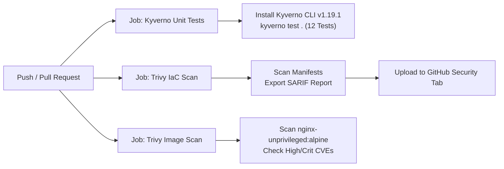

# Kyverno Security Lab

A hands-on, enterprise-grade lab for implementing Kubernetes cluster security, governance, and DevSecOps using Policy-as-Code with **Kyverno** and **Trivy**. This project demonstrates standard, Kubernetes-native Kyverno `ClusterPolicy` (`kyverno.io/v1`) and `PolicyException` (`kyverno.io/v2`) spanning **Validation**, **Mutation**, **Generation**, shift-left offline testing, and continuous security scanning.

---

## Table of Contents

- [Project Overview](#project-overview)
- [Enterprise DevSecOps Architecture](#enterprise-devsecops-architecture)
- [Pod Security Standards (PSS) & Compliance Matrix](#pod-security-standards-pss--compliance-matrix)
- [Key Features](#key-features)
- [Repository Structure](#repository-structure)
- [Prerequisites & CLI Installation](#prerequisites--cli-installation)
  - [Installing Kyverno CLI](#installing-kyverno-cli)
  - [Installing Trivy](#installing-trivy)
- [Local Shift-Left Security Scans (Trivy & Kyverno CLI)](#local-shift-left-security-scans-trivy--kyverno-cli)
- [GitHub Actions CI/CD Pipeline](#github-actions-cicd-pipeline)
  - [Workflow Jobs Breakdown](#workflow-jobs-breakdown)
  - [Continuous Security in Action](#continuous-security-in-action)
- [Quick Start (Automated Lab)](#quick-start-automated-lab)
- [Step-by-Step Lab Walkthrough](#step-by-step-lab-walkthrough)
  - [1. Provision Local Cluster with Kind](#1-provision-local-cluster-with-kind)
  - [2. Install Kyverno via Helm](#2-install-kyverno-via-helm)
  - [3. Verify Kyverno Deployment](#3-verify-kyverno-deployment)
  - [4. Deploy Security Policies & Exceptions](#4-deploy-security-policies--exceptions)
  - [5. Test Policy Enforcement, Mutation, Generation & Exceptions](#5-test-policy-enforcement-mutation-generation--exceptions)
    - [Negative Test 1: Reject Pod Without Limits](#negative-test-1-reject-pod-without-limits)
    - [Negative Test 2: Reject Privileged Container](#negative-test-2-reject-privileged-container)
    - [Negative Test 3: Reject Root User Container](#negative-test-3-reject-root-user-container)
    - [Negative Test 4: Reject Pod with :latest Tag](#negative-test-4-reject-pod-with-latest-tag)
    - [Mutation Test: Auto-Inject Security Defaults & Labels](#mutation-test-auto-inject-security-defaults--labels)
    - [Generation Test: Auto-Provision Default NetworkPolicy](#generation-test-auto-provision-default-networkpolicy)
    - [Exception Test: Scoped Exemption for Monitoring DaemonSet](#exception-test-scoped-exemption-for-monitoring-daemonset)
    - [Positive Test: Accept Fully Compliant Pod](#positive-test-accept-fully-compliant-pod)
- [Policy Deep Dive: Rules & Mechanics](#policy-deep-dive-rules--mechanics)
  - [Policy 1: Require Resource Limits (require-limits.yaml)](#policy-1-require-resource-limits-require-limitsyaml)
  - [Policy 2: Restrict Privileged Containers (restrict-privilege.yaml)](#policy-2-restrict-privileged-containers-restrict-privilegeyaml)
  - [Policy 3: Restrict Root User (restrict-root-user.yaml)](#policy-3-restrict-root-user-restrict-root-useryaml)
  - [Policy 4: Auto-Inject Security Defaults (mutate-security-context.yaml)](#policy-4-auto-inject-security-defaults-mutate-security-contextyaml)
  - [Policy 5: Disallow Latest Tag (disallow-latest-tag.yaml)](#policy-5-disallow-latest-tag-disallow-latest-tagyaml)
  - [Policy 6: Auto-Generate NetworkPolicy (generate-default-networkpolicy.yaml)](#policy-6-auto-generate-networkpolicy-generate-default-networkpolicyyaml)
  - [Feature: Enterprise Exemption Management (policy-exception-monitoring.yaml)](#feature-enterprise-exemption-management-policy-exception-monitoringyaml)
- [Testing with Kyverno CLI (Shift-Left / CI/CD)](#testing-with-kyverno-cli-shift-left--cicd)
  - [Running the Declarative Test Suite](#running-the-declarative-test-suite)
  - [Single Policy Ad-Hoc Evaluation](#single-policy-ad-hoc-evaluation)
- [Observability: Policy Reports & Auditing](#observability-policy-reports--auditing)
- [Production Hardening & Failure Modes](#production-hardening--failure-modes)
- [Troubleshooting & Verification](#troubleshooting--verification)
- [Cleanup](#cleanup)
- [Best Practices & Next Steps](#best-practices--next-steps)

---

## Project Overview

In multi-tenant or production Kubernetes environments, uncontrolled container workloads can compromise cluster availability, compliance, and infrastructure boundaries:
- **Resource Exhaustion:** Workloads missing CPU/memory limits cause noisy neighbors, CPU throttling, or Out-Of-Memory (OOM-killer) node instability.
- **Privilege Escalation & Breakout:** Containers running in privileged mode (`securityContext.privileged: true`) bypass Linux cgroups, namespaces, and AppArmor/seccomp boundaries, effectively gaining root control over the host node.
- **Root User Execution:** Containers running as root (`UID 0`) increase the blast radius if an application is compromised.
- **Mutable & Untracked Images:** Workloads pulling `:latest` tags or omitting image tags cause unpredictable deployment drift, non-reproducible releases, and potential supply chain tampering.
- **Flat Network Lateral Movement:** Namespaces created without default network isolation allow unrestricted east-west traffic between sensitive internal services.
- **Operational Reality (Break-Glass Exceptions):** System monitoring or security daemonsets (like Falco, Promtail, or node-exporter) legitimately require elevated permissions. Without declarative, scoped exemptions, teams often disable policies entirely.

This lab provides production-grade solutions across all three pillars of the Kyverno engine (**Validation**, **Mutation**, and **Generation**), paired with official **PolicyException** controls and supply chain static analysis with Trivy.

---

## Enterprise DevSecOps Architecture

Production-grade platform engineering teams protect Kubernetes clusters using a synchronized **Two-Layer Security Defense**:

```
[ Developer Commit / Pull Request ]
                 │
                 ▼
┌─────────────────────────────────────────────────────────────┐
│ Layer 1: Shift-Left Security (Local & CI/CD Pipeline)       │
│                                                             │
│ • Trivy IaC Scanner: Detects Kubernetes misconfigurations   │
│ • Trivy CVE Scanner: Scans container images for CVEs        │
│ • Kyverno CLI: Executes declarative policy unit tests       │
│   (Validates, Mutates, Generates & Tests Exceptions offline)│
└──────────────────────────────┬──────────────────────────────┘
                               │ (Blocks non-compliant PRs before merge)
                               ▼
┌─────────────────────────────────────────────────────────────┐
│ Layer 2: In-Cluster Admission & Governance (Runtime)        │
│                                                             │
│ • Kyverno Mutating Webhook: Injects security defaults & tags│
│ • Kyverno Validating Webhook: Denies non-compliant pods     │
│ • Kyverno Generating Controller: Provisions NetworkPolicies │
│ • Kyverno Exception Engine: Scopes auditable exemptions     │
│ • Kyverno PolicyReports: In-cluster continuous compliance   │
└─────────────────────────────────────────────────────────────┘
```

---

## Pod Security Standards (PSS) & Compliance Matrix

This repository enforces controls directly mapped to the **Kubernetes Pod Security Standards (PSS)** and the **CIS Kubernetes Benchmark**:

| Policy / Control | Rule Type | PSS Level | CIS K8s Benchmark | Business / Security Impact |
| :--- | :--- | :--- | :--- | :--- |
| `require-limits.yaml` | Validation | Governance | 5.2.1 | Prevents DoS, noisy neighbors, and node OOM eviction cascades. |
| `restrict-privilege.yaml` | Validation | Baseline / Restricted | 5.2.5 | Blocks host container breakouts and root access to node devices. |
| `restrict-root-user.yaml` | Validation | Restricted | 5.2.6 | Restricts UID 0 execution, mitigating host kernel exploit escalation. |
| `disallow-latest-tag.yaml` | Validation | Best Practices | 5.5.1 | Prevents immutable release drift and supply-chain tag hijacking. |
| `mutate-security-context.yaml` | Mutation | Restricted | 5.2.4 | Auto-injects `allowPrivilegeEscalation: false` & audit compliance tags. |
| `generate-default-networkpolicy.yaml` | Generation | Zero-Trust | 5.3.2 | Automatically isolates newly provisioned tenant namespaces. |
| `policy-exception-monitoring.yaml` | Exception | Governance | N/A | Declarative, auditable bypass for trusted infrastructure agents. |

---

## Key Features

- **The Complete Kyverno Engine Suite:** Covers **Validation** (rejection), **Mutation** (auto-remediation), and **Generation** (automatic resource provisioning).
- **Official PolicyException (CRD):** Production pattern for granular exceptions (e.g. system monitoring daemonsets) without weakening cluster-wide policies.
- **Image Immutability & Tag Governance:** Validates that manifests use explicit semantic version tags or digests, rejecting mutable `:latest` tags.
- **Zero-Trust Network Isolation:** Automatically creates a default-deny Ingress `NetworkPolicy` whenever a new namespace is initialized.
- **Standard CRDs:** Adheres to official Kubernetes and Kyverno schemas (`kyverno.io/v1`, `kyverno.io/v2`, `cli.kyverno.io/v1alpha1`).
- **Offline Shift-Left Testing:** Declarative unit test suite (`kyverno-test.yaml`) testing 12 test assertions offline in milliseconds.
- **IaC & Image Vulnerability Scanning:** Integrated with Aqua Security's **Trivy** for misconfiguration and CVE scanning.
- **Automated CI/CD Pipeline:** Fully configured GitHub Actions workflow (`.github/workflows/security-ci.yml`) exporting SARIF security reports.
- **Cross-Platform Automation:** Complete end-to-end lab scripts for both Linux/macOS/WSL (`run-lab.sh`, `scan.sh`) and Windows (`run-lab.ps1`, `scan.ps1`).

---

## Repository Structure

```plaintext
kyverno-security-lab/
├── .github/
│   └── workflows/
│       └── security-ci.yml                 # GitHub Actions CI workflow (Kyverno CLI + Trivy IaC/Image)
├── kind-config.yaml                        # Kind multi-node cluster configuration (1 control plane, 1 worker)
│
├── require-limits.yaml                     # Policy: Enforce CPU & memory resource limits
├── restrict-privilege.yaml                 # Policy: Restrict privileged containers
├── restrict-root-user.yaml                 # Policy: Enforce non-root execution (runAsNonRoot: true)
├── disallow-latest-tag.yaml                # Policy: Disallow ':latest' or untagged container images
├── mutate-security-context.yaml            # Policy: Auto-inject security defaults & compliance labels
├── generate-default-networkpolicy.yaml     # Policy: Auto-generate default-deny NetworkPolicy on new Namespace
├── policy-exception-monitoring.yaml        # Governance: Scoped PolicyException for monitoring daemonset
│
├── bad-pod.yaml                            # Negative test: Missing resource limits
├── bad-pod-priv.yaml                       # Negative test: Requests privileged mode
├── bad-pod-root.yaml                       # Negative test: Missing runAsNonRoot: true
├── bad-pod-latest.yaml                     # Negative test: Uses ':latest' image tag
├── mutate-pod.yaml                         # Mutation test: Manifest omits security defaults
├── mutated-pod-expected.yaml               # Mutation fixture: Expected post-mutation manifest state
├── test-namespace.yaml                     # Generation test: Tenant namespace trigger
├── generated-networkpolicy-expected.yaml   # Generation fixture: Expected generated NetworkPolicy
├── exception-pod-monitoring.yaml           # Exception test: node-exporter requiring elevated access
├── good-pod.yaml                           # Positive test: Fully compliant workload
│
├── kyverno-test.yaml                       # Kyverno CLI declarative unit test suite (12 test cases)
├── scan.sh                                 # Local DevSecOps scanner script (Linux / macOS / WSL)
├── scan.ps1                                # Local DevSecOps scanner script (Windows PowerShell)
├── run-lab.sh                              # Automated end-to-end lab runner (Linux / macOS / WSL)
├── run-lab.ps1                             # Automated end-to-end lab runner (Windows PowerShell)
└── README.md                               # Comprehensive documentation and lab guide
```

---

## Prerequisites & CLI Installation

### Core Tools

| Tool | Recommended Version | Purpose |
| :--- | :--- | :--- |
| [Docker](https://docs.docker.com/get-docker/) | `>= 24.0` | Container runtime engine |
| [Kind](https://kind.sigs.k8s.io/) | `>= 0.20` | Local multi-node Kubernetes cluster management |
| [kubectl](https://kubernetes.io/docs/tasks/tools/) | `>= 1.28` | Kubernetes CLI |
| [Helm](https://helm.sh/) | `>= 3.12` | Kubernetes package manager for Kyverno installation |

### Installing Kyverno CLI

The Kyverno CLI (`kyverno`) enables local and CI/CD policy testing without a Kubernetes cluster:

- **Windows (Winget):**
  ```powershell
  winget install Kyverno.kyverno
  ```
- **Windows (Scoop):**
  ```powershell
  scoop install kyverno-cli
  ```
- **macOS / Linux (Homebrew):**
  ```bash
  brew install kyverno
  ```
- **Direct Binary (GitHub Releases):**
  Download the pre-compiled binary directly from [Kyverno Releases](https://github.com/kyverno/kyverno/releases).

### Installing Trivy

Trivy provides static vulnerability and IaC misconfiguration scanning:

- **Windows (Scoop / Winget):**
  ```powershell
  winget install AquaSecurity.Trivy
  ```
- **macOS / Linux (Homebrew):**
  ```bash
  brew install trivy
  ```

---

## Local Shift-Left Security Scans (Trivy & Kyverno CLI)

You can run comprehensive pre-commit security audits on your machine without starting Docker or Kind:

### On Windows (PowerShell)
```powershell
.\scan.ps1
```
*To skip container image scanning and run only IaC / policy checks:*
```powershell
.\scan.ps1 -SkipImageScan
```

### On Linux / macOS / WSL
```bash
chmod +x scan.sh
./scan.sh
```

**What this executes:**
1. **`kyverno test .`**: Executes all 12 unit tests declared in `kyverno-test.yaml`, validating all policies, mutations, generations, and policy exceptions.
2. **`trivy config .`**: Scans all Kubernetes YAML files for misconfigurations against CIS Kubernetes Benchmarks.
3. **`trivy image ...`**: Scans the compliant container image (`nginxinc/nginx-unprivileged:alpine`) for CVE vulnerabilities.

---

## GitHub Actions CI/CD Pipeline

The repository includes an automated enterprise GitHub Actions workflow located at [`.github/workflows/security-ci.yml`](.github/workflows/security-ci.yml).

### Workflow Triggers
- Automatic execution on every `push` to branch `main`.
- Automatic execution on all `pull_request` events targeting `main`.
- Manual on-demand execution via `workflow_dispatch`.

### Workflow Jobs Breakdown



---

## Quick Start (Automated Lab)

If you have all prerequisites installed and Docker running, you can execute the entire live cluster lab end-to-end:

### Linux / macOS / WSL
```bash
chmod +x run-lab.sh
./run-lab.sh
```

### Windows (PowerShell)
```powershell
.\run-lab.ps1
```

### Script Actions & Subcommands
Both scripts support granular subcommands:
- `all` (default): Runs prerequisite checks, provisions the cluster, installs Kyverno, deploys all policies/exceptions, and executes all tests.
- `up`: Provisions the Kind cluster and installs Kyverno + all security policies and exceptions.
- `test`: Executes negative, mutation, generation, exception, and positive tests against the active cluster.
- `down`: Cleans up test resources, removes policies, and destroys the Kind cluster.

*Example on Linux/macOS:*
```bash
./run-lab.sh test    # Run only policy tests
./run-lab.sh down    # Tear down cluster and cleanup
```

*Example on Windows:*
```powershell
.\run-lab.ps1 -Action test   # Run only policy tests
.\run-lab.ps1 -Action down   # Tear down cluster and cleanup
```

---

## Step-by-Step Lab Walkthrough

### 1. Provision Local Cluster with Kind

Spin up the multi-node Kind cluster using [kind-config.yaml](file:///D:/Enterprise%20Development/Go-projects/kyverno-security-lab/kind-config.yaml):

```bash
kind create cluster --config kind-config.yaml --name kyverno-lab
```

Verify that the cluster is healthy and nodes are in `Ready` state:

```bash
kubectl cluster-info --context kind-kyverno-lab
kubectl get nodes
```

---

### 2. Install Kyverno via Helm

Add the official Kyverno Helm repository and deploy Kyverno into namespace `kyverno`:

```bash
helm repo add kyverno https://kyverno.github.io/kyverno/
helm repo update
helm install kyverno kyverno/kyverno --namespace kyverno --create-namespace
```

---

### 3. Verify Kyverno Deployment

Wait until all Kyverno controller pods are running and ready:

```bash
kubectl wait --namespace kyverno \
  --for=condition=ready pod \
  --selector=app.kubernetes.io/part-of=kyverno \
  --timeout=180s
```

Check the pods and Custom Resource Definitions (CRDs):

```bash
kubectl get pods -n kyverno
kubectl get crd | grep kyverno
```

---

### 4. Deploy Security Policies & Exceptions

Apply the complete policy suite (validation, mutation, generation, and exceptions):

```bash
# Deploy Policies
kubectl apply -f require-limits.yaml
kubectl apply -f restrict-privilege.yaml
kubectl apply -f restrict-root-user.yaml
kubectl apply -f mutate-security-context.yaml
kubectl apply -f disallow-latest-tag.yaml
kubectl apply -f generate-default-networkpolicy.yaml

# Deploy Exception for Monitoring Namespace
kubectl create namespace monitoring --dry-run=client -o yaml | kubectl apply -f -
kubectl apply -f policy-exception-monitoring.yaml
```

Verify that all cluster policies and exceptions are installed and ready:

```bash
kubectl get clusterpolicy
kubectl get policyexception -A
```

*Expected output:*
```plaintext
NAME                              ADMISSION   BACKGROUND   READY   AGE   MESSAGE
disallow-latest-tag               true        true         true    10s   Ready
generate-default-networkpolicy    true        true         true    10s   Ready
mutate-pod-security-defaults      true        false        true    10s   Ready
require-cpu-memory-limits         true        true         true    10s   Ready
restrict-privileged-containers    true        true         true    10s   Ready
restrict-root-user                true        true         true    10s   Ready
```

---

### 5. Test Policy Enforcement, Mutation, Generation & Exceptions

#### Negative Test 1: Reject Pod Without Limits

Attempt to deploy [bad-pod.yaml](file:///D:/Enterprise%20Development/Go-projects/kyverno-security-lab/bad-pod.yaml):

```bash
kubectl apply -f bad-pod.yaml
```

**Expected Result:** Kyverno admission webhook intercepts and blocks pod creation with a `403 Forbidden` error.

---

#### Negative Test 2: Reject Privileged Container

Attempt to deploy [bad-pod-priv.yaml](file:///D:/Enterprise%20Development/Go-projects/kyverno-security-lab/bad-pod-priv.yaml):

```bash
kubectl apply -f bad-pod-priv.yaml
```

**Expected Result:** Kyverno blocks the pod because `securityContext.privileged: true` is prohibited.

---

#### Negative Test 3: Reject Root User Container

Attempt to deploy [bad-pod-root.yaml](file:///D:/Enterprise%20Development/Go-projects/kyverno-security-lab/bad-pod-root.yaml):

```bash
kubectl apply -f bad-pod-root.yaml
```

**Expected Result:** Kyverno blocks the pod because `securityContext.runAsNonRoot: true` is missing.

---

#### Negative Test 4: Reject Pod with :latest Tag

Attempt to deploy [bad-pod-latest.yaml](file:///D:/Enterprise%20Development/Go-projects/kyverno-security-lab/bad-pod-latest.yaml):

```bash
kubectl apply -f bad-pod-latest.yaml
```

**Expected Result:** Kyverno blocks admission because `nginx:latest` uses a prohibited mutable tag.

---

#### Mutation Test: Auto-Inject Security Defaults & Labels

Deploy [mutate-pod.yaml](file:///D:/Enterprise%20Development/Go-projects/kyverno-security-lab/mutate-pod.yaml), which intentionally omits `allowPrivilegeEscalation` and compliance labels:

```bash
kubectl apply -f mutate-pod.yaml
```

**Expected Result (Admission Accepted & Auto-Mutated):**

```plaintext
pod/test-pod-mutate created
```

Inspect the live pod to verify that Kyverno injected the governance label and security default:

```bash
kubectl get pod test-pod-mutate -o jsonpath='{.metadata.labels.security\.kyverno\.io/hardened}'
# Output: true

kubectl get pod test-pod-mutate -o jsonpath='{.spec.containers[0].securityContext.allowPrivilegeEscalation}'
# Output: false
```

---

#### Generation Test: Auto-Provision Default NetworkPolicy

Deploy a new tenant namespace using [test-namespace.yaml](file:///D:/Enterprise%20Development/Go-projects/kyverno-security-lab/test-namespace.yaml):

```bash
kubectl apply -f test-namespace.yaml
```

**Expected Result:** Kyverno's generation controller automatically provisions a default-deny Ingress `NetworkPolicy` inside `tenant-billing`:

```bash
kubectl get networkpolicy -n tenant-billing
```

*Output:*
```plaintext
NAME                   POD-SELECTOR   AGE
default-deny-ingress   <none>         5s
```

---

#### Exception Test: Scoped Exemption for Monitoring DaemonSet

Deploy [exception-pod-monitoring.yaml](file:///D:/Enterprise%20Development/Go-projects/kyverno-security-lab/exception-pod-monitoring.yaml) into the `monitoring` namespace:

```bash
kubectl apply -f exception-pod-monitoring.yaml
```

**Expected Result:** Even though the container runs as root, Kyverno evaluates [policy-exception-monitoring.yaml](file:///D:/Enterprise%20Development/Go-projects/kyverno-security-lab/policy-exception-monitoring.yaml) and **permits admission**, logging a `skip` result instead of rejecting the workload.

---

#### Positive Test: Accept Fully Compliant Pod

Deploy [good-pod.yaml](file:///D:/Enterprise%20Development/Go-projects/kyverno-security-lab/good-pod.yaml), which satisfies all resource limit, non-root, and explicit image tag requirements:

```bash
kubectl apply -f good-pod.yaml
```

**Expected Result (Admission Allowed):**

```plaintext
pod/test-pod-good created
```

Verify that the pod is running and inspect its allocated resources:

```bash
kubectl get pod test-pod-good
kubectl get pod test-pod-good -o jsonpath='{.spec.containers[*].resources}'
```

---

## Policy Deep Dive: Rules & Mechanics

### Policy 1: Require Resource Limits ([require-limits.yaml](file:///D:/Enterprise%20Development/Go-projects/kyverno-security-lab/require-limits.yaml))

Enforces that every container, `initContainer`, and `ephemeralContainer` specifies CPU and memory limits.

```yaml
spec:
  validationFailureAction: Enforce
  background: true
  rules:
    - name: check-cpu-memory-limits
      match:
        any:
          - resources:
              kinds:
                - Pod
      validate:
        message: "CPU and memory resource limits are required for all containers."
        pattern:
          spec:
            containers:
              - resources:
                  limits:
                    cpu: "?*"
                    memory: "?*"
```

---

### Policy 2: Restrict Privileged Containers ([restrict-privilege.yaml](file:///D:/Enterprise%20Development/Go-projects/kyverno-security-lab/restrict-privilege.yaml))

Uses Kyverno conditional anchors `=(field): value` to prohibit containers from requesting `privileged: true`.

```yaml
spec:
  validationFailureAction: Enforce
  background: true
  rules:
    - name: validate-privileged
      match:
        any:
          - resources:
              kinds:
                - Pod
      validate:
        message: "Privileged mode is prohibited. Containers must not request securityContext.privileged: true."
        pattern:
          spec:
            containers:
              - =(securityContext):
                  =(privileged): "false"
```

---

### Policy 3: Restrict Root User ([restrict-root-user.yaml](file:///D:/Enterprise%20Development/Go-projects/kyverno-security-lab/restrict-root-user.yaml))

Mandates that workloads explicitly configure `securityContext.runAsNonRoot: true`.

```yaml
spec:
  validationFailureAction: Enforce
  background: true
  rules:
    - name: validate-non-root
      match:
        any:
          - resources:
              kinds:
                - Pod
      validate:
        message: "Running as root is prohibited. Containers must set securityContext.runAsNonRoot: true."
        pattern:
          spec:
            containers:
              - securityContext:
                  runAsNonRoot: true
```

---

### Policy 4: Auto-Inject Security Defaults ([mutate-security-context.yaml](file:///D:/Enterprise%20Development/Go-projects/kyverno-security-lab/mutate-security-context.yaml))

Demonstrates patch-strategic-merge mutation with addition anchors `+(field)` to add defaults without overwriting developer-provided values:

```yaml
spec:
  background: false
  rules:
    - name: inject-audit-label
      match:
        any:
          - resources:
              kinds:
                - Pod
      mutate:
        patchStrategicMerge:
          metadata:
            labels:
              +(security.kyverno.io/hardened): "true"

    - name: inject-allow-privilege-escalation
      match:
        any:
          - resources:
              kinds:
                - Pod
      mutate:
        patchStrategicMerge:
          spec:
            containers:
              - (name): "*"
                securityContext:
                  +(allowPrivilegeEscalation): false
```

---

### Policy 5: Disallow Latest Tag ([disallow-latest-tag.yaml](file:///D:/Enterprise%20Development/Go-projects/kyverno-security-lab/disallow-latest-tag.yaml))

Ensures software supply chain traceability by blocking images tagged `:latest` or omitting tags. Workloads must use an explicit tag or SHA256 digest (`*@sha256:*`):

```yaml
spec:
  validationFailureAction: Enforce
  background: true
  rules:
    - name: validate-image-tag
      match:
        any:
          - resources:
              kinds:
                - Pod
      validate:
        message: "Using ':latest' image tag or omitting tags is prohibited. Provide an explicit version tag or digest."
        pattern:
          spec:
            containers:
              - image: "!*:latest & *:* | *@*"
```

---

### Policy 6: Auto-Generate NetworkPolicy ([generate-default-networkpolicy.yaml](file:///D:/Enterprise%20Development/Go-projects/kyverno-security-lab/generate-default-networkpolicy.yaml))

Implements zero-trust isolation by auto-generating a default-deny Ingress `NetworkPolicy` whenever a new `Namespace` is created:

```yaml
spec:
  rules:
    - name: create-default-deny-ingress
      match:
        any:
          - resources:
              kinds:
                - Namespace
      generate:
        apiVersion: networking.k8s.io/v1
        kind: NetworkPolicy
        name: default-deny-ingress
        namespace: "{{request.object.metadata.name}}"
        synchronize: true
        data:
          metadata:
            labels:
              app.kubernetes.io/managed-by: kyverno
              security.kyverno.io/network-tier: isolated
          spec:
            podSelector: {}
            policyTypes:
              - Ingress
```

---

### Feature: Enterprise Exemption Management ([policy-exception-monitoring.yaml](file:///D:/Enterprise%20Development/Go-projects/kyverno-security-lab/policy-exception-monitoring.yaml))

Provides an auditable, fine-grained exception mechanism using Kyverno's official `PolicyException` CRD (`kyverno.io/v2`). Rather than adding messy `exclude` blocks inside the core policy, exemptions are decoupled and managed independently:

```yaml
apiVersion: kyverno.io/v2
kind: PolicyException
metadata:
  name: monitoring-root-exception
  namespace: monitoring
spec:
  exceptions:
    - policyName: restrict-root-user
      ruleNames:
        - validate-non-root
  match:
    any:
      - resources:
          kinds:
            - Pod
          namespaces:
            - monitoring
          names:
            - "node-exporter*"
```

---

## Testing with Kyverno CLI (Shift-Left / CI/CD)

### Running the Declarative Test Suite (`kyverno test`)

The repository includes a comprehensive declarative test suite in [kyverno-test.yaml](file:///D:/Enterprise%20Development/Go-projects/kyverno-security-lab/kyverno-test.yaml). Run:

```bash
kyverno test .
```

*Output:*
```plaintext
Loading test  ( kyverno-test.yaml ) ...
  Loading policies ...
  Loading resources ...
  Loading exceptions ...
  Applying 6 policies to 8 resources with 1 exception ...
  Checking results ...

│──────────│────────────────────────────────│───────────────────────────────────│───────────────────────────────────────│────────│────────│
│ ID (12)  │ POLICY                         │ RULE                              │ RESOURCE                              │ RESULT │ REASON │
│──────────│────────────────────────────────│───────────────────────────────────│───────────────────────────────────────│────────│────────│
│ 1        │ mutate-pod-security-defaults   │ inject-audit-label                │ v1/Pod/default/test-pod-mutate        │ Pass   │ Ok     │
│ 2        │ mutate-pod-security-defaults   │ inject-allow-privilege-escalation │ v1/Pod/default/test-pod-mutate        │ Pass   │ Ok     │
│ 3        │ require-cpu-memory-limits      │ check-cpu-memory-limits           │ v1/Pod/default/test-pod-bad           │ Pass   │ Ok     │
│ 4        │ require-cpu-memory-limits      │ check-cpu-memory-limits           │ v1/Pod/default/test-pod-good          │ Pass   │ Ok     │
│ 5        │ restrict-privileged-containers │ validate-privileged               │ v1/Pod/default/test-pod-hacker-priv   │ Pass   │ Ok     │
│ 6        │ restrict-privileged-containers │ validate-privileged               │ v1/Pod/default/test-pod-good          │ Pass   │ Ok     │
│ 7        │ restrict-root-user             │ validate-non-root                 │ v1/Pod/default/test-pod-bad-root      │ Pass   │ Ok     │
│ 8        │ restrict-root-user             │ validate-non-root                 │ v1/Pod/default/test-pod-good          │ Pass   │ Ok     │
│ 9        │ restrict-root-user             │ validate-non-root                 │ v1/Pod/monitoring/node-exporter-agent │ Pass   │ Ok     │
│ 10       │ disallow-latest-tag            │ validate-image-tag                │ v1/Pod/default/test-pod-latest        │ Pass   │ Ok     │
│ 11       │ disallow-latest-tag            │ validate-image-tag                │ v1/Pod/default/test-pod-good          │ Pass   │ Ok     │
│ 12       │ generate-default-networkpolicy │ create-default-deny-ingress       │ /default-deny-ingress                 │ Pass   │ Ok     │
│──────────│────────────────────────────────│───────────────────────────────────│───────────────────────────────────────│────────│────────│

Test Summary: 12 tests passed and 0 tests failed
```

---

### Single Policy Ad-Hoc Evaluation

You can evaluate individual policies against specific manifests using `kyverno apply`:

```bash
# Test resource limit enforcement
kyverno apply require-limits.yaml --resource bad-pod.yaml      # Fails (missing limits)
kyverno apply require-limits.yaml --resource good-pod.yaml     # Passes

# Test latest tag restriction
kyverno apply disallow-latest-tag.yaml --resource bad-pod-latest.yaml  # Fails (latest tag)
kyverno apply disallow-latest-tag.yaml --resource good-pod.yaml        # Passes

# Test PolicyException evaluation
kyverno apply restrict-root-user.yaml --resource exception-pod-monitoring.yaml --exception policy-exception-monitoring.yaml # Result: skip (permitted)

# Test mutation policy (applies mutation and prints mutated manifest)
kyverno apply mutate-security-context.yaml --resource mutate-pod.yaml

# Test generation policy
kyverno apply generate-default-networkpolicy.yaml --resource test-namespace.yaml
```

---

## Observability: Policy Reports & Auditing

Kyverno implements the Kubernetes **WG-Policy PolicyReport** standard. It automatically performs background scans of active cluster workloads and produces native `PolicyReport` and `ClusterPolicyReport` custom resources:

```bash
# Inspect cluster-wide policy reports
kubectl get clusterpolicyreport -o wide

# Inspect namespace-scoped reports
kubectl get policyreports -A

# Check detailed audit findings for a specific namespace
kubectl describe policyreport -n default
```

For real-time visual monitoring, you can deploy the open-source **Policy Reporter UI** (`kyverno/policy-reporter`), which exposes Prometheus metrics (`kyverno_policy_results_total`) and Grafana dashboards for cluster compliance posture.

---

## Production Hardening & Failure Modes

When moving from a local lab to multi-cluster production:

1. **`failurePolicy: Fail` vs `failurePolicy: Ignore`**:
   - `failurePolicy: Fail`: Rejects requests if the Kyverno admission webhook is unreachable. Recommended for production security policies.
   - `failurePolicy: Ignore`: Allows requests if Kyverno is unavailable. Recommended during initial cluster bootstrap or policy trials.
2. **Exclude Critical System Namespaces**:
   Always protect `kube-system`, `kube-public`, and the `kyverno` namespace itself from being locked out by user-defined policies.
3. **High Availability (HA)**:
   Deploy Kyverno with at least 3 replicas spread across multiple availability zones using `podAntiAffinity` and a `PodDisruptionBudget`.
4. **Gradual Policy Rollout (`Audit` -> `Enforce`)**:
   Always deploy new policies with `validationFailureAction: Audit` first. Inspect generated `PolicyReport` objects to measure impact on existing workloads before setting `validationFailureAction: Enforce`.

---

## Troubleshooting & Verification

- **Check Kyverno Controller Logs:**
  ```bash
  kubectl logs -n kyverno -l app.kubernetes.io/name=kyverno -f
  ```
- **Inspect Policy Reports:**
  ```bash
  kubectl get clusterpolicyreport -A
  kubectl describe clusterpolicyreport
  ```
- **Inspect Mutating & Validating Webhooks:**
  ```bash
  kubectl get mutatingwebhookconfigurations
  kubectl get validatingwebhookconfigurations
  ```

---

## Cleanup

When finished with the lab, clean up deployed resources or tear down the entire Kind cluster:

```bash
# Using the automated script:
./run-lab.sh down          # Linux / macOS / WSL
.\run-lab.ps1 -Action down # Windows PowerShell

# Or manually:
kubectl delete pod test-pod-good test-pod-bad test-pod-hacker-priv test-pod-bad-root test-pod-latest test-pod-mutate --ignore-not-found
kubectl delete pod node-exporter-agent -n monitoring --ignore-not-found
kubectl delete namespace tenant-billing monitoring --ignore-not-found
kubectl delete -f require-limits.yaml --ignore-not-found
kubectl delete -f restrict-privilege.yaml --ignore-not-found
kubectl delete -f restrict-root-user.yaml --ignore-not-found
kubectl delete -f mutate-security-context.yaml --ignore-not-found
kubectl delete -f disallow-latest-tag.yaml --ignore-not-found
kubectl delete -f generate-default-networkpolicy.yaml --ignore-not-found
kind delete cluster --name kyverno-lab
```

---

## Best Practices & Next Steps

1. **Adopt Two-Layer Defense:** Enforce policies in CI/CD with Trivy & Kyverno CLI before deploying to Kubernetes.
2. **Pair Mutation with Validation:** Auto-inject secure defaults at admission, while retaining strict validation rules for critical boundaries.
3. **Automate Zero-Trust with Generation:** Use `generate` rules to provision baseline `NetworkPolicy` and `ResourceQuota` objects for all new namespaces.
4. **Manage Exemptions Decoupled via `PolicyException`:** Keep policies clean and auditable by managing workload exemptions via separate CRDs.
5. **Enforce Requests alongside Limits:** Prevent node overcommitment by pairing limits with guaranteed requests.
6. **Disallow Privileged Containers & Root Users:** Adhere to Pod Security Standards Restricted profile.
7. **Disallow `:latest` Image Tags:** Enforce immutable image tags or SHA256 digests in manifests.

---

## License

This project is licensed under the MIT License.
