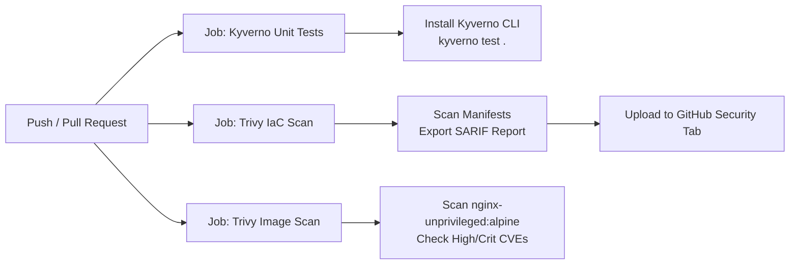

# Kyverno Security Lab

A hands-on, enterprise-grade lab for implementing Kubernetes cluster security, governance, and DevSecOps using Policy-as-Code with **Kyverno** and **Trivy**. This project demonstrates standard, Kubernetes-native Kyverno `ClusterPolicy` (`kyverno.io/v1`) validation, mutation, shift-left offline testing, and continuous security scanning.

---

## Table of Contents

- [Project Overview](#project-overview)
- [Enterprise DevSecOps Architecture](#enterprise-devsecops-architecture)
- [Key Features](#key-features)
- [Repository Structure](#repository-structure)
- [Prerequisites & CLI Installation](#prerequisites--cli-installation)
  - [Installing Kyverno CLI](#installing-kyverno-cli)
  - [Installing Trivy](#installing-trivy)
- [Quick Start (Automated Lab)](#quick-start-automated-lab)
- [Local Shift-Left Security Scans (Trivy & Kyverno CLI)](#local-shift-left-security-scans-trivy--kyverno-cli)
- [GitHub Actions CI/CD Pipeline](#github-actions-cicd-pipeline)
  - [Workflow Jobs Breakdown](#workflow-jobs-breakdown)
  - [Continuous Security in Action](#continuous-security-in-action)
- [Step-by-Step Lab Walkthrough](#step-by-step-lab-walkthrough)
  - [1. Provision Local Cluster with Kind](#1-provision-local-cluster-with-kind)
  - [2. Install Kyverno via Helm](#2-install-kyverno-via-helm)
  - [3. Verify Kyverno Deployment](#3-verify-kyverno-deployment)
  - [4. Deploy the Security Policies](#4-deploy-the-security-policies)
  - [5. Test Policy Enforcement & Mutation](#5-test-policy-enforcement--mutation)
    - [Negative Test 1: Reject Pod Without Limits](#negative-test-1-reject-pod-without-limits)
    - [Negative Test 2: Reject Privileged Container](#negative-test-2-reject-privileged-container)
    - [Negative Test 3: Reject Root User Container](#negative-test-3-reject-root-user-container)
    - [Mutation Test: Auto-Inject Security Defaults & Labels](#mutation-test-auto-inject-security-defaults--labels)
    - [Positive Test: Accept Compliant Pod](#positive-test-accept-compliant-pod)
- [Policy Deep Dive: ClusterPolicy](#policy-deep-dive-clusterpolicy)
  - [Policy 1: Require Resource Limits (require-limits.yaml)](#policy-1-require-resource-limits-require-limitsyaml)
  - [Policy 2: Restrict Privileged Containers (restrict-privilege.yaml)](#policy-2-restrict-privileged-containers-restrict-privilegeyaml)
  - [Policy 3: Restrict Root User (restrict-root-user.yaml)](#policy-3-restrict-root-user-restrict-root-useryaml)
  - [Policy 4: Auto-Inject Security Defaults (mutate-security-context.yaml)](#policy-4-auto-inject-security-defaults-mutate-security-contextyaml)
- [Testing with Kyverno CLI (Shift-Left / CI/CD)](#testing-with-kyverno-cli-shift-left--cicd)
  - [Running the Declarative Test Suite](#running-the-declarative-test-suite)
  - [Single Policy Ad-Hoc Evaluation](#single-policy-ad-hoc-evaluation)
- [Troubleshooting & Verification](#troubleshooting--verification)
- [Cleanup](#cleanup)
- [Best Practices & Next Steps](#best-practices--next-steps)

---

## Project Overview

In multi-tenant or production Kubernetes environments, uncontrolled container workloads can compromise cluster availability and security:
- **Resource Exhaustion:** Workloads missing CPU/memory limits cause noisy neighbors, CPU throttling, or Out-Of-Memory (OOM-killer) node instability.
- **Privilege Escalation & Breakout:** Containers running in privileged mode (`securityContext.privileged: true`) bypass Linux cgroups, namespaces, and AppArmor/seccomp boundaries, effectively gaining root control over the host node.
- **Root User Execution:** Containers running as root (`UID 0`) increase the blast radius if an application is compromised.
- **Inconsistent Baseline Hardening:** Developers may omit security flags like `allowPrivilegeEscalation: false` or compliance labels, creating governance gaps.

This lab demonstrates how to enforce mandatory resource governance, block dangerous privileged containers, and automatically mutate workloads at admission time to inject security defaults using Kyverno, while guarding the software supply chain with Trivy.

---

## Enterprise DevSecOps Architecture

Production-grade platform engineering teams protect Kubernetes clusters using a synchronized **Two-Layer Security Defense**:

```
[ Developer Commit / Pull Request ]
                 │
                 ▼
┌─────────────────────────────────────────────────────────────┐
│ Layer 1: Shift-Left Security (Local & CI/CD Pipeline)       │
│                                                             │
│ • Trivy IaC Scanner: Detects Kubernetes misconfigurations   │
│ • Trivy CVE Scanner: Scans container images for CVEs        │
│ • Kyverno CLI: Executes declarative policy unit tests       │
│   (Runs offline in seconds without requiring a cluster)     │
└──────────────────────────────┬──────────────────────────────┘
                               │ (Blocks non-compliant PRs before merge)
                               ▼
┌─────────────────────────────────────────────────────────────┐
│ Layer 2: In-Cluster Admission & Governance (Runtime)         │
│                                                             │
│ • Kyverno Mutating Webhook: Injects security defaults & tags│
│ • Kyverno Validating Webhook: Denies non-compliant pods     │
│ • Kyverno PolicyReports: In-cluster continuous compliance   │
└─────────────────────────────────────────────────────────────┘
```

---

## Key Features

- **Policy-as-Code:** Declarative policy definitions managed under version control.
- **Standard CRD:** Uses the production-standard `kyverno.io/v1` `ClusterPolicy` resource.
- **Validation & Mutation Engines:** Combines admission blocking rules (`validate`) with automated manifest self-healing (`mutate`).
- **Pod Security Standards (Baseline & Restricted):** Blocks privileged container workloads, mandates non-root execution, and disallows privilege escalation.
- **Offline Shift-Left Testing:** Includes a native `kyverno test` suite (`kyverno-test.yaml`) for instant policy unit testing without a cluster.
- **IaC & Image Vulnerability Scanning:** Integrated with Aqua Security's **Trivy** for misconfiguration and CVE scanning.
- **Automated CI/CD Pipeline:** Fully configured GitHub Actions workflow (`.github/workflows/security-ci.yml`) uploading SARIF reports to GitHub Security.
- **Automated Lab Runners:** Cross-platform scripts (`run-lab.sh`, `run-lab.ps1`, `scan.sh`, `scan.ps1`) for local automation.

---

## Repository Structure

```plaintext
kyverno-security-lab/
├── .github/
│   └── workflows/
│       └── security-ci.yml       # GitHub Actions CI workflow (Trivy + Kyverno CLI)
├── kind-config.yaml              # Kind multi-node cluster configuration (1 control plane, 1 worker)
├── require-limits.yaml           # Kyverno ClusterPolicy enforcing CPU & memory limits
├── restrict-privilege.yaml       # Kyverno ClusterPolicy restricting privileged mode containers
├── restrict-root-user.yaml       # Kyverno ClusterPolicy enforcing runAsNonRoot: true
├── mutate-security-context.yaml  # Kyverno ClusterPolicy auto-injecting security defaults & audit labels
├── bad-pod.yaml                  # Negative test case (violates policy, missing limits)
├── bad-pod-priv.yaml             # Negative test case (violates policy, requests privileged mode)
├── bad-pod-root.yaml             # Negative test case (violates policy, runs as root user)
├── mutate-pod.yaml               # Mutation test case (omits security defaults to verify auto-injection)
├── good-pod.yaml                 # Positive test case (conforms to all policies)
├── kyverno-test.yaml             # Kyverno CLI native policy unit test suite
├── scan.sh                       # Local DevSecOps scanner script (Linux / macOS / WSL)
├── scan.ps1                      # Local DevSecOps scanner script (Windows PowerShell)
├── run-lab.sh                    # Automated end-to-end lab script (Linux / macOS / WSL)
├── run-lab.ps1                   # Automated end-to-end lab script (Windows PowerShell)
└── README.md                     # Project documentation and hands-on guide
```

---

## Prerequisites & CLI Installation

### Core Tools

| Tool | Recommended Version | Purpose |
| :--- | :--- | :--- |
| [Docker](https://docs.docker.com/get-docker/) | `>= 24.0` | Container runtime engine |
| [Kind](https://kind.sigs.k8s.io/) | `>= 0.20` | Local multi-node Kubernetes cluster management |
| [kubectl](https://kubernetes.io/docs/tasks/tools/) | `>= 1.28` | Kubernetes CLI |
| [Helm](https://helm.sh/) | `>= 3.12` | Kubernetes package manager for Kyverno installation |

### Installing Kyverno CLI

The Kyverno CLI (`kyverno`) enables local and CI/CD policy testing without a Kubernetes cluster:

- **Windows (Scoop):**
  ```powershell
  scoop install kyverno-cli
  ```
- **Windows (Winget):**
  ```powershell
  winget install Kyverno.kyverno
  ```
- **macOS / Linux (Homebrew):**
  ```bash
  brew install kyverno
  ```
- **Direct Binary (GitHub Releases):**
  Download the pre-compiled binary directly from [Kyverno Releases](https://github.com/kyverno/kyverno/releases).

### Installing Trivy

Trivy provides static vulnerability and IaC misconfiguration scanning:

- **Windows (Scoop):**
  ```powershell
  scoop install trivy
  ```
- **macOS / Linux (Homebrew):**
  ```bash
  brew install trivy
  ```

---

## Local Shift-Left Security Scans (Trivy & Kyverno CLI)

You can run comprehensive pre-commit security audits on your machine without starting Docker or Kind:

### On Windows (PowerShell)
```powershell
.\scan.ps1
```
*To skip container image scanning and run only IaC / policy checks:*
```powershell
.\scan.ps1 -SkipImageScan
```

### On Linux / macOS / WSL
```bash
chmod +x scan.sh
./scan.sh
```

**What this executes:**
1. **`kyverno test .`**: Executes all unit tests declared in `kyverno-test.yaml`, verifying that policies fail and pass expected manifests.
2. **`trivy config .`**: Scans all Kubernetes YAML files for misconfigurations against CIS Kubernetes Benchmarks.
3. **`trivy image ...`**: Scans the compliant container image (`nginxinc/nginx-unprivileged:alpine`) for CVE vulnerabilities.

---

## GitHub Actions CI/CD Pipeline

The repository includes an automated enterprise GitHub Actions workflow located at [`.github/workflows/security-ci.yml`](.github/workflows/security-ci.yml).

### Workflow Triggers
- Automatic execution on every `push` to branch `main`.
- Automatic execution on all `pull_request` events targeting `main`.
- Manual on-demand execution via `workflow_dispatch`.

### Workflow Jobs Breakdown



1. **`kyverno-test`**:
   - Uses `kyverno/action-install-cli@v0.4.0` to set up the official Kyverno binary on Ubuntu runners.
   - Runs `kyverno test .` against `kyverno-test.yaml`.
   - Validates that non-compliant manifests are rejected and compliant manifests pass.
2. **`trivy-iac-scan`**:
   - Uses `aquasecurity/trivy-action@master` to perform IaC misconfiguration scanning on the repository.
   - Generates a standard `trivy-iac-results.sarif` report.
   - Automatically uploads the SARIF report to the GitHub **Security -> Code Scanning** dashboard.
3. **`trivy-image-scan`**:
   - Scans the compliant container image (`nginxinc/nginx-unprivileged:alpine`) for HIGH and CRITICAL vulnerabilities, ensuring supply-chain hygiene.

---

## Quick Start (Automated Lab)

If you have all prerequisites installed and Docker running, you can execute the entire live cluster lab end-to-end:

### Linux / macOS / WSL
```bash
chmod +x run-lab.sh
./run-lab.sh
```

### Windows (PowerShell)
```powershell
.\run-lab.ps1
```

### Script Actions & Subcommands
Both scripts support granular subcommands:
- `all` (default): Runs prerequisite checks, provisions the cluster, installs Kyverno, deploys all policies, and executes all tests.
- `up`: Provisions the Kind cluster and installs Kyverno + all security policies.
- `test`: Executes negative, mutation, and positive tests against the active cluster.
- `down`: Cleans up test pods, removes policies, and destroys the Kind cluster.

*Example on Linux/macOS:*
```bash
./run-lab.sh test    # Run only policy tests
./run-lab.sh down    # Tear down cluster and cleanup
```

*Example on Windows:*
```powershell
.\run-lab.ps1 -Action test   # Run only policy tests
.\run-lab.ps1 -Action down   # Tear down cluster and cleanup
```

---

## Step-by-Step Lab Walkthrough

### 1. Provision Local Cluster with Kind

Spin up the multi-node Kind cluster using `kind-config.yaml`:

```bash
kind create cluster --config kind-config.yaml --name kyverno-lab
```

Verify that the cluster is healthy and nodes are in `Ready` state:

```bash
kubectl cluster-info --context kind-kyverno-lab
kubectl get nodes
```

---

### 2. Install Kyverno via Helm

Add the official Kyverno Helm repository and deploy Kyverno into namespace `kyverno`:

```bash
helm repo add kyverno https://kyverno.github.io/kyverno/
helm repo update
helm install kyverno kyverno/kyverno --namespace kyverno --create-namespace
```

---

### 3. Verify Kyverno Deployment

Wait until all Kyverno controller pods are running and ready:

```bash
kubectl wait --namespace kyverno \
  --for=condition=ready pod \
  --selector=app.kubernetes.io/part-of=kyverno \
  --timeout=120s
```

Check the pods and Custom Resource Definitions (CRDs):

```bash
kubectl get pods -n kyverno
kubectl get crd | grep kyverno
```

---

### 4. Deploy the Security Policies

Apply all four policies (three validation policies and one mutation policy):

```bash
kubectl apply -f require-limits.yaml
kubectl apply -f restrict-privilege.yaml
kubectl apply -f restrict-root-user.yaml
kubectl apply -f mutate-security-context.yaml
```

Verify that all cluster policies are installed and ready:

```bash
kubectl get clusterpolicy
```

*Expected output:*
```plaintext
NAME                              ADMISSION   BACKGROUND   READY   AGE   MESSAGE
mutate-pod-security-defaults      true        false        true    10s   Ready
require-cpu-memory-limits         true        true         true    10s   Ready
restrict-privileged-containers    true        true         true    10s   Ready
restrict-root-user                true        true         true    10s   Ready
```

---

### 5. Test Policy Enforcement & Mutation

#### Negative Test 1: Reject Pod Without Limits

Attempt to deploy `bad-pod.yaml`:

```bash
kubectl apply -f bad-pod.yaml
```

**Expected Result:** Kyverno admission webhook intercepts and blocks pod creation with a `403 Forbidden` validation error.

---

#### Negative Test 2: Reject Privileged Container

Attempt to deploy `bad-pod-priv.yaml`:

```bash
kubectl apply -f bad-pod-priv.yaml
```

**Expected Result:** Kyverno blocks the pod because `securityContext.privileged: true` is prohibited.

---

#### Negative Test 3: Reject Root User Container

Attempt to deploy `bad-pod-root.yaml`:

```bash
kubectl apply -f bad-pod-root.yaml
```

**Expected Result:** Kyverno blocks the pod because `securityContext.runAsNonRoot: true` is missing.

---

#### Mutation Test: Auto-Inject Security Defaults & Labels

Deploy `mutate-pod.yaml`, which defines resource limits and non-root execution, but intentionally omits `allowPrivilegeEscalation` and the hardening label:

```bash
kubectl apply -f mutate-pod.yaml
```

**Expected Result (Admission Accepted & Auto-Mutated):**

```plaintext
pod/test-pod-mutate created
```

Inspect the live pod to verify that Kyverno injected the governance label and security default:

```bash
kubectl get pod test-pod-mutate -o jsonpath='{.metadata.labels.security\.kyverno\.io/hardened}'
# Output: true

kubectl get pod test-pod-mutate -o jsonpath='{.spec.containers[0].securityContext.allowPrivilegeEscalation}'
# Output: false
```

---

#### Positive Test: Accept Compliant Pod

Deploy `good-pod.yaml`, which explicitly defines resource limits, runs as non-root, and avoids privileged mode:

```bash
kubectl apply -f good-pod.yaml
```

**Expected Result (Admission Allowed):**

```plaintext
pod/test-pod-good created
```

Verify the pod is running and inspect its allocated resources:

```bash
kubectl get pod test-pod-good
kubectl get pod test-pod-good -o jsonpath='{.spec.containers[*].resources}'
```

---

## Policy Deep Dive: ClusterPolicy

### Policy 1: Require Resource Limits (require-limits.yaml)

```yaml
apiVersion: kyverno.io/v1
kind: ClusterPolicy
metadata:
  name: require-cpu-memory-limits
spec:
  validationFailureAction: Enforce
  background: true
  rules:
    - name: check-cpu-memory-limits
      match:
        any:
          - resources:
              kinds:
                - Pod
      validate:
        message: "CPU and memory resource limits are required for all containers."
        pattern:
          spec:
            containers:
              - resources:
                  limits:
                    cpu: "?*"
                    memory: "?*"
```

---

### Policy 2: Restrict Privileged Containers (restrict-privilege.yaml)

```yaml
apiVersion: kyverno.io/v1
kind: ClusterPolicy
metadata:
  name: restrict-privileged-containers
spec:
  validationFailureAction: Enforce
  background: true
  rules:
    - name: validate-privileged
      match:
        any:
          - resources:
              kinds:
                - Pod
      validate:
        message: "Privileged mode is prohibited. Containers must not request securityContext.privileged: true."
        pattern:
          spec:
            containers:
              - =(securityContext):
                  =(privileged): "false"
```

---

### Policy 3: Restrict Root User (restrict-root-user.yaml)

```yaml
apiVersion: kyverno.io/v1
kind: ClusterPolicy
metadata:
  name: restrict-root-user
spec:
  validationFailureAction: Enforce
  background: true
  rules:
    - name: validate-non-root
      match:
        any:
          - resources:
              kinds:
                - Pod
      validate:
        message: "Running as root is prohibited. Containers must set securityContext.runAsNonRoot: true."
        pattern:
          spec:
            containers:
              - securityContext:
                  runAsNonRoot: true
```

---

### Policy 4: Auto-Inject Security Defaults (mutate-security-context.yaml)

```yaml
apiVersion: kyverno.io/v1
kind: ClusterPolicy
metadata:
  name: mutate-pod-security-defaults
spec:
  background: false
  rules:
    - name: inject-audit-label
      match:
        any:
          - resources:
              kinds:
                - Pod
      mutate:
        patchStrategicMerge:
          metadata:
            labels:
              +(security.kyverno.io/hardened): "true"

    - name: inject-allow-privilege-escalation
      match:
        any:
          - resources:
              kinds:
                - Pod
      mutate:
        patchStrategicMerge:
          spec:
            containers:
              - (name): "*"
                securityContext:
                  +(allowPrivilegeEscalation): false
```

### Key Mutation Concepts

1. **`patchStrategicMerge`**: Merges declarative snippets directly into the target resource.
2. **Conditional Anchor `(name): "*"`**: Matches every container in the `containers` array regardless of its name.
3. **Addition Anchor `+(field): value`**: Injects the specified field and value **only if it does not already exist**. If the workload already defines `allowPrivilegeEscalation`, Kyverno preserves the author's explicit configuration.

---

## Testing with Kyverno CLI (Shift-Left / CI/CD)

### Running the Declarative Test Suite (`kyverno test`)

The repository includes a declarative test suite in `kyverno-test.yaml`. Once the Kyverno CLI is installed, simply run:

```bash
kyverno test .
```

> **Note:** Do **not** append filenames like `using kyverno-test.yaml`. The CLI automatically detects the `kyverno-test.yaml` file in the current working directory (`.`).

*Expected output:*
```plaintext
Executing kyverno-security-lab-tests...
applying 4 policies to 5 resources...

│───│───────────────────────────────│─────────────────────────│──────────────│────────│
│ # │ POLICY                        │ RULE                    │ RESOURCE     │ RESULT │
│───│───────────────────────────────│─────────────────────────│──────────────│────────│
│ 1 │ require-cpu-memory-limits     │ check-cpu-memory-limits │ test-pod-bad │ Pass   │
│ 2 │ require-cpu-memory-limits     │ check-cpu-memory-limits │ test-pod-good│ Pass   │
│ 3 │ restrict-privileged-containers│ validate-privileged     │ test-pod-hack│ Pass   │
│ 4 │ restrict-privileged-containers│ validate-privileged     │ test-pod-good│ Pass   │
│ 5 │ restrict-root-user            │ validate-non-root       │ test-pod-bad-│ Pass   │
│ 6 │ restrict-root-user            │ validate-non-root       │ test-pod-good│ Pass   │
│ 7 │ mutate-pod-security-defaults  │ inject-audit-label      │ test-pod-muta│ Pass   │
│ 8 │ mutate-pod-security-defaults  │ inject-allow-privilege- │ test-pod-muta│ Pass   │
│───│───────────────────────────────│─────────────────────────│──────────────│────────│
```

---

### Single Policy Ad-Hoc Evaluation

You can also evaluate individual policies against specific manifests:

```bash
# Test resource limit enforcement
kyverno apply require-limits.yaml --resource bad-pod.yaml      # Fails (missing limits)
kyverno apply require-limits.yaml --resource good-pod.yaml     # Passes

# Test privileged container restriction
kyverno apply restrict-privilege.yaml --resource bad-pod-priv.yaml  # Fails (privileged: true)
kyverno apply restrict-privilege.yaml --resource good-pod.yaml      # Passes

# Test root user restriction
kyverno apply restrict-root-user.yaml --resource bad-pod-root.yaml  # Fails (missing runAsNonRoot)
kyverno apply restrict-root-user.yaml --resource good-pod.yaml      # Passes

# Test mutation policy (applies mutation and prints mutated manifest)
kyverno apply mutate-security-context.yaml --resource mutate-pod.yaml
```

---

## Troubleshooting & Verification

- **Check Kyverno Controller Logs:**
  ```bash
  kubectl logs -n kyverno -l app.kubernetes.io/name=kyverno -f
  ```
- **Inspect Policy Reports:**
  ```bash
  kubectl get clusterpolicyreport -A
  kubectl describe clusterpolicyreport
  ```
- **Check Mutating and Validating Webhook Configurations:**
  ```bash
  kubectl get mutatingwebhookconfigurations
  kubectl get validatingwebhookconfigurations
  ```

---

## Cleanup

When finished with the lab, clean up deployed pods or tear down the entire Kind cluster:

```bash
# Using the automated script:
./run-lab.sh down          # Linux / macOS / WSL
.\run-lab.ps1 -Action down # Windows PowerShell

# Or manually:
kubectl delete pod test-pod-good test-pod-bad test-pod-hacker-priv test-pod-bad-root test-pod-mutate --ignore-not-found
kubectl delete -f require-limits.yaml --ignore-not-found
kubectl delete -f restrict-privilege.yaml --ignore-not-found
kubectl delete -f restrict-root-user.yaml --ignore-not-found
kubectl delete -f mutate-security-context.yaml --ignore-not-found
kind delete cluster --name kyverno-lab
```

---

## Best Practices & Next Steps

1. **Adopt Two-Layer Defense:** Enforce policies in CI/CD with Trivy & Kyverno CLI before deploying to Kubernetes.
2. **Pair Mutation with Validation:** Auto-inject secure defaults at admission, while retaining strict validation rules for critical boundaries.
3. **Enforce Requests alongside Limits:** Prevent node overcommitment by pairing limits with guaranteed requests.
4. **Disallow Privileged Containers:** Ensure `securityContext.privileged: false` is enforced across all workloads.
5. **Prevent Root Users:** Require containers to run as non-root (`runAsNonRoot: true`).
6. **Disallow `:latest` Image Tags:** Enforce immutable image tags or SHA256 digests in manifests.
7. **Gradual Rollout:** Deploy new policies with `validationFailureAction: Audit` first to assess impact before switching to `Enforce`.

---

## License

This project is licensed under the MIT License.
